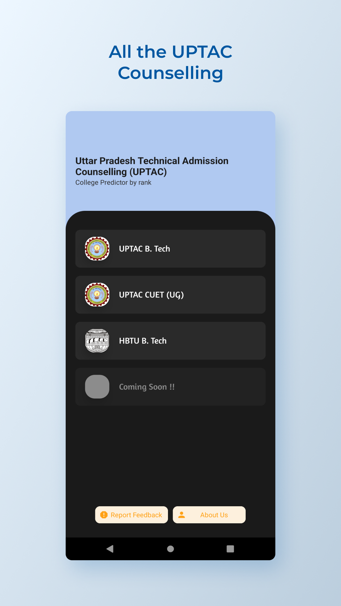
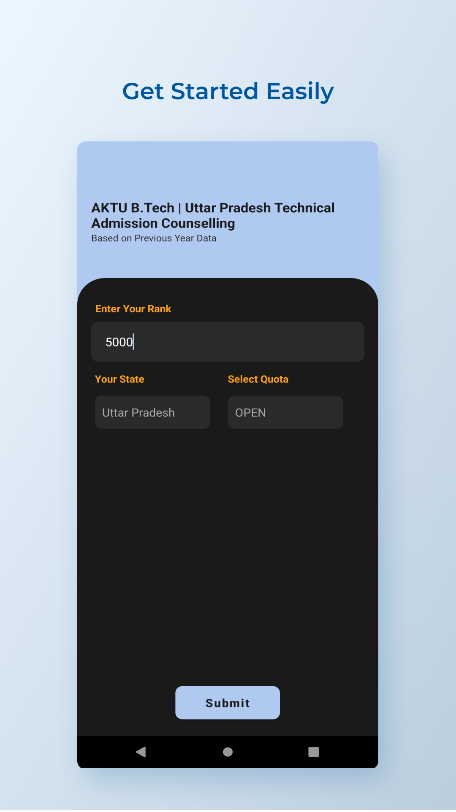
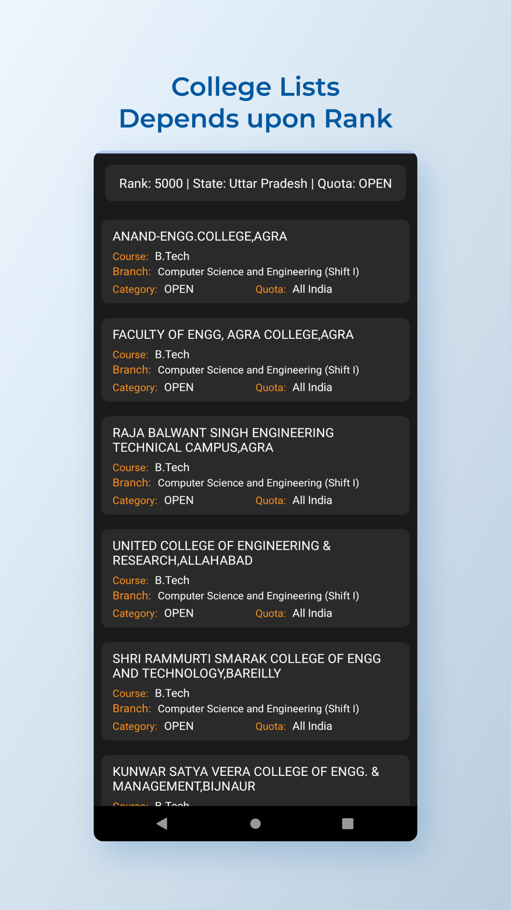

# Aktu Rank Predictor
Predict your college and make decision wisely !

## 🔗 Download the App 

## 📸 Screenshots
 
 
 

  
 

||||
|:----------------------------------------:|:-----------------------------------------:|:-----------------------------------------: |
|  |  |  |

## Projects Description:
Introducing the Ultimate AKTU College Predictor: Your Path to Informed Decisions!

Embarking on your higher education journey is a critical step towards shaping your future, and we understand the significance of making well-informed choices. With the upcoming AKTU Students in mind, we are proud to unveil our cutting-edge Android application designed to empower you with accurate insights and seamless user experiences.

- Our application is powered by meticulously gathered and up-to-date data from previous year cutoffs, ensuring unparalleled precision in predicting the colleges that align with your rank.
- Our preferences matter, and we respect that. Tailor your results with precision by filtering colleges based on your desired state or quota.
- We understand the value of user-friendly interfaces, and we've taken extra measures to ensure a seamless and intuitive experience.
- Our app's predictions are based solely on historical cutoff data, ensuring that the information you receive is errorless and meticulously calculated.

Embark on your journey to higher education with confidence. The Ultimate AKTU College Predictor is your trusted companion in making the right choices for a brighter tomorrow. Your future awaits – make your move!
