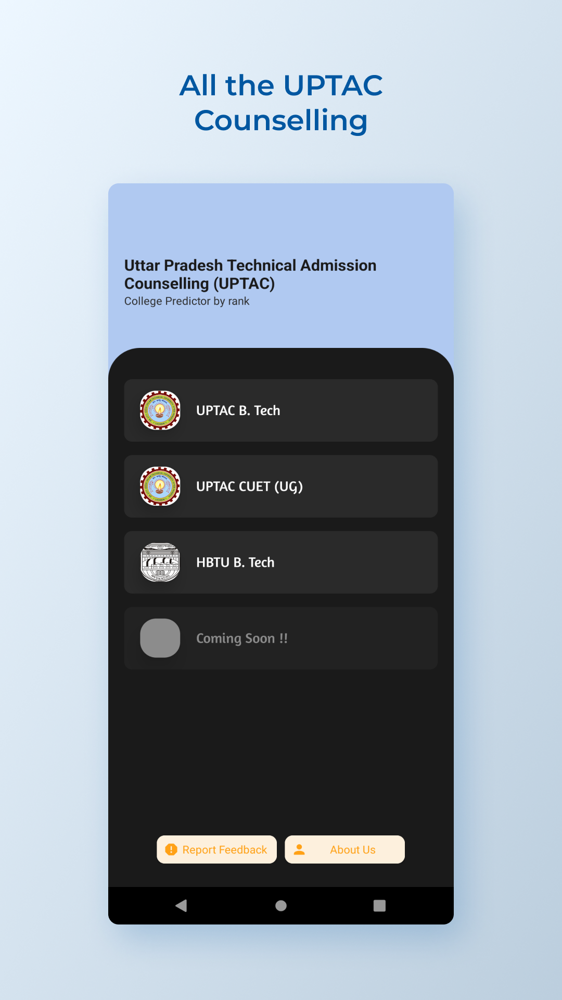
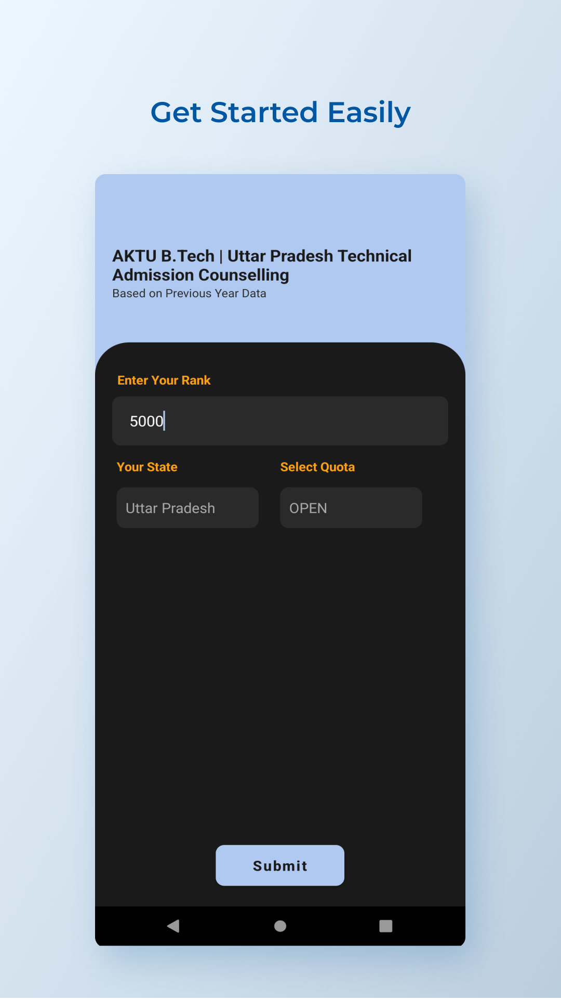
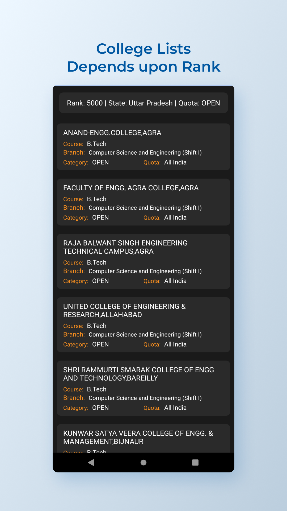

# AKTU Rank Predictor - Multi-Exam College Predictor

A modern, scalable Android application that helps students predict their college admissions across multiple entrance exams including JEE Main, JEE Advance, AKTU B.Tech, and more.

## 🔗 Download the App [3200+ Downloads]

<a href="https://play.google.com/store/apps/details?id=akturankpredictorbyamitmaity.example.akturankpredictor">
</a>

## 🎯 Features

### ✨ **Multi-Exam Support**
- **JEE Main**: All India engineering colleges
- **JEE Advance**: IITs and premier institutions
- **AKTU B.Tech**: Uttar Pradesh technical colleges
- **AKTU CUET**: CUET-based admissions
- **HBTU B.Tech**: Harcourt Butler Technical University
- **Extensible**: Easy to add new exams via JSON configuration

### 🎨 **Modern UI/UX**
- **Material Design**: Clean, modern interface
- **Dynamic Icons**: Exam-specific icons loaded from JSON
- **Circular Progress**: Smooth loading animations
- **Responsive Design**: Works on all screen sizes
- **Dark/Light Themes**: Adaptive color schemes

### 🔍 **Advanced Filtering**
- **Rank-based**: Predict colleges within your rank range
- **State-wise**: Filter by home state or other states
- **Quota-based**: General, EWS, OBC, SC, ST categories
- **Gender-specific**: Male, Female, or All categories
- **Real-time Search**: Search colleges by name, course, or state

### 📊 **Data Management**
- **Offline Configuration**: Exam lists and filter options stored locally
- **Online Data**: College data fetched from APIs
- **Standardized Format**: Unified JSON structure for all exams
- **Caching**: Efficient data storage and retrieval

## 🏗️ Architecture

### **Clean Architecture Pattern**
```
┌─────────────────────────────────────────────────────────────┐
│                    Presentation Layer                       │
├─────────────────────────────────────────────────────────────┤
│  Activities │ Adapters │ ViewModels │ UI Components        │
├─────────────────────────────────────────────────────────────┤
│                    Domain Layer                             │
├─────────────────────────────────────────────────────────────┤
│  Services │ Use Cases │ Business Logic │ Validation        │
├─────────────────────────────────────────────────────────────┤
│                    Data Layer                               │
├─────────────────────────────────────────────────────────────┤
│  Repositories │ API Services │ Local Storage │ Models       │
└─────────────────────────────────────────────────────────────┘
```

### **Key Components**

#### **📱 Presentation Layer**
- **MainActivity**: Home screen with exam selection
- **SelectRankActivity**: User preferences and filters
- **ShowCollegesActivity**: College results display
- **ChatActivity**: Mentor guide chat feature
- **Adapters**: RecyclerView adapters for lists

#### **🔧 Domain Layer**
- **CollegeService**: Business logic for college operations
- **FilterOptionsService**: Filter management
- **ExamService**: Exam data management
- **Validation**: Input validation and error handling

#### **💾 Data Layer**
- **CollegeRepository**: College data operations
- **FilterOptionsRepository**: Filter options management
- **ExamRepository**: Exam configuration management
- **ApiClient**: Retrofit-based API communication

## 🛠️ Technical Stack

### **Core Technologies**
- **Language**: Kotlin
- **Platform**: Android (API 26+)
- **Architecture**: MVVM with Clean Architecture
- **UI Framework**: Android Views with Material Design

### **Libraries & Dependencies**
```gradle
// Networking
implementation 'com.squareup.retrofit2:retrofit:2.11.0'
implementation 'com.squareup.retrofit2:converter-gson:2.11.0'
implementation 'com.squareup.okhttp3:logging-interceptor:4.12.0'

// Asynchronous Programming
implementation 'org.jetbrains.kotlinx:kotlinx-coroutines-android:1.7.3'
implementation 'org.jetbrains.kotlinx:kotlinx-coroutines-core:1.7.3'

// Lifecycle & Architecture Components
implementation 'androidx.lifecycle:lifecycle-runtime-ktx:2.7.0'
implementation 'androidx.lifecycle:lifecycle-viewmodel-ktx:2.7.0'

// UI Components
implementation 'com.google.android.material:material:1.12.0'
implementation 'androidx.cardview:cardview:1.0.0'
implementation 'de.hdodenhof:circleimageview:3.1.0'

// Firebase (Optional)
implementation platform('com.google.firebase:firebase-bom:33.1.2')
implementation 'com.google.firebase:firebase-messaging-ktx'
implementation 'com.google.firebase:firebase-analytics-ktx'
```

## 📊 Data Structure

### **Standardized JSON Format**
All college data follows this unified structure:

```json
{
  "institute": "College Name",
  "course": "Course Name",
  "state_quota": "HS/OS/AI",
  "quota": "General/Ews/Obc/Sc/St",
  "gender": "Both/Male/Female",
  "or": 12345,
  "cr": 67890,
  "state": "State Name"
}
```

### **Field Definitions**

#### **state_quota Values**
- **HS**: Home State (only for students from that state)
- **OS**: Other State (only for students from other states)
- **AI**: All India (for students from any state)

#### **quota Values**
- **General**: General category
- **Ews**: Economically Weaker Section
- **Obc**: Other Backward Classes
- **Sc**: Scheduled Castes
- **St**: Scheduled Tribes

#### **gender Values**
- **Both**: Open for all genders
- **Male**: Male only
- **Female**: Female only

## 🚀 Getting Started

### **Prerequisites**
- Android Studio Arctic Fox or later
- Android SDK API 26+
- Kotlin 1.8+
- Gradle 7.0+

### **Installation**
1. Clone the repository
   ```bash
   git clone https://github.com/maityamit/Aktu_Rank_Predictor.git
   ```

2. Open the project in Android Studio

3. Sync Gradle files and build the project

4. Run the app on an emulator or device

### **Configuration**
1. **Add Exam Data**: Place JSON files in the root directory
2. **Update API Endpoints**: Modify `ApiClient.kt` if needed
3. **Configure Firebase**: Add `google-services.json` for notifications

## 📁 Project Structure

```
app/src/main/
├── java/akturankpredictorbyamitmaity/example/akturankpredictor/
│   ├── adapter/                 # RecyclerView adapters
│   │   ├── CollegeAdapter.kt
│   │   └── ExamAdapter.kt
│   ├── api/                    # API interfaces and clients
│   │   ├── ApiClient.kt
│   │   └── CollegeApiService.kt
│   ├── chat/                   # Chat functionality
│   │   ├── ChatActivity.kt
│   │   └── ChatAdapter.kt
│   ├── data/                   # Data layer
│   │   ├── model/              # Data models
│   │   │   ├── College.kt
│   │   │   ├── Exam.kt
│   │   │   ├── UserPreferences.kt
│   │   │   └── ApiResponse.kt
│   │   └── repository/         # Data repositories
│   │       ├── CollegeRepository.kt
│   │       ├── ExamRepository.kt
│   │       └── FilterOptionsRepository.kt
│   ├── messaging/              # Firebase messaging
│   │   └── FirebaseService.java
│   ├── service/                # Business logic services
│   │   ├── CollegeService.kt
│   │   ├── ExamService.kt
│   │   └── FilterOptionsService.kt
│   ├── MainActivity.kt         # Main entry point
│   ├── SelectRankActivity.kt   # User preferences
│   ├── ShowCollegesActivity.kt # Results display
│   └── SplashActivity.kt       # Splash screen
├── res/                        # Resources
│   ├── drawable/               # Images and drawables
│   ├── layout/                 # UI layouts
│   ├── values/                 # Strings, colors, themes
│   └── assets/                 # JSON configuration files
└── AndroidManifest.xml         # App manifest
```

## 🔧 Configuration Files

### **exams.json** - Exam Configuration
```json
[
  {
    "id": "jee_main",
    "name": "JEE Main",
    "endpoint": "jee_main",
    "description": "Joint Entrance Examination Main",
    "icon": "jee_main_logo",
    "isActive": true
  }
]
```

### **filter_options.json** - Filter Options
```json
{
  "states": ["All", "Uttar Pradesh", "Delhi", "Maharashtra"],
  "genders": ["All", "Male", "Female"],
  "quotas": ["All", "General", "Ews", "Obc", "Sc", "St"]
}
```

## 🎨 UI Components

### **Custom Drawables**
- **Circular Progress**: Custom animated progress indicators
- **Gradient Backgrounds**: Modern gradient backgrounds
- **Rounded Corners**: Consistent border radius
- **Card Elevations**: Material Design shadows

### **Color Scheme**
- **Primary**: #1976D2 (Blue)
- **Secondary**: #42A5F5 (Light Blue)
- **Background**: Light gradient backgrounds
- **Text**: Dark gray (#1A1A1A) for readability

## 🔄 State Management

### **Loading States**
- **Button Loading**: Circular progress in buttons
- **Screen Loading**: Full-screen loading with messages
- **Error Handling**: User-friendly error messages
- **Success Feedback**: Toast messages for successful operations

### **Data Flow**
1. **User Input** → Validation → API Call
2. **API Response** → Data Processing → Filtering
3. **Filtered Results** → UI Update → User Display

## 🧪 Testing

### **Unit Tests**
- Repository layer testing
- Service layer testing
- Data model validation

### **UI Tests**
- Activity navigation testing
- User interaction testing
- Screen state testing

## 📱 Screenshots

<p align="center">

</p>

|  |  |  |
|:--------------------------:|:---------------------------:|:----------------------:|
| **Home Screen** - Modern exam selection | **Select Rank** - User preferences | **Results** - College predictions |

## 🤝 Contributing

1. Fork the repository
2. Create a feature branch (`git checkout -b feature/AmazingFeature`)
3. Commit your changes (`git commit -m 'Add some AmazingFeature'`)
4. Push to the branch (`git push origin feature/AmazingFeature`)
5. Open a Pull Request

## 📄 License

This project is licensed under the MIT License - see the [LICENSE](LICENSE) file for details.

## 👨‍💻 Developers

**Amit Maity** - Lead Developer
- Email: maityamit307@gmail.com
- LinkedIn: [Amit Maity](https://www.linkedin.com/in/maityamit)

**Nitish Kumar** - UI/UX Developer
- LinkedIn: [Nitish Kumar](https://www.linkedin.com/in/infiniteesh)

## 🙏 Acknowledgments

- **AKTU**: For providing admission data
- **JEE**: For examination structure
- **Material Design**: For UI guidelines
- **Open Source Community**: For libraries and tools

## 📞 Support

For support, email maityamit307@gmail.com or create an issue in this repository.

---

**Made with ❤️ for students by students**
